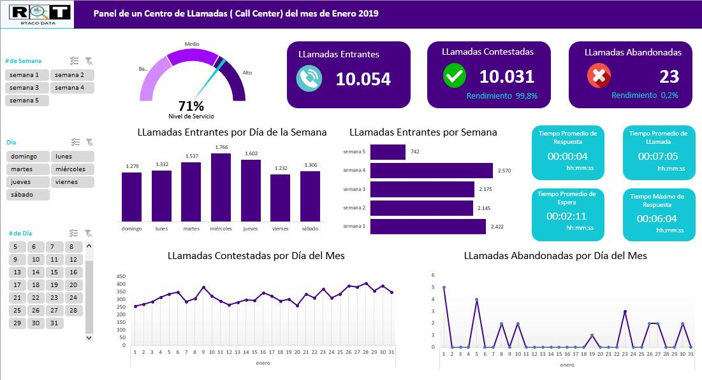

# Dashboard of callcenter R&T DATA

How to create a dashboard callcenter with EXCEL.

# Targets

* Velocímetro del Nivel de Servicio.
* Cards con las llamadas entrantes, contestadas y abandonadas.
* Rendimiento de llamadas contestadas y abandonadas (%).
* Gráfico de columnas agrupadas de las llamadas entrantes por día de la semana.
* Gráfico de barras agrupadas de las llamadas entrantes por semana.
* Extracción usando las tablas dinámicas para los tiempos promedio de respuesta, de llamada, de espera y tiempo máximo de respuesta.
* Gráfico de líneas simple del indicador LLamadas contestadas por día del mes.
* Gráfico de líneas simple del indicador LLamadas abandonadas por día del mes.
* Segmentación asociada al promedio del Nivel de Servicio para los indicadores por # de semana, día y # de día.

## Screenshot

